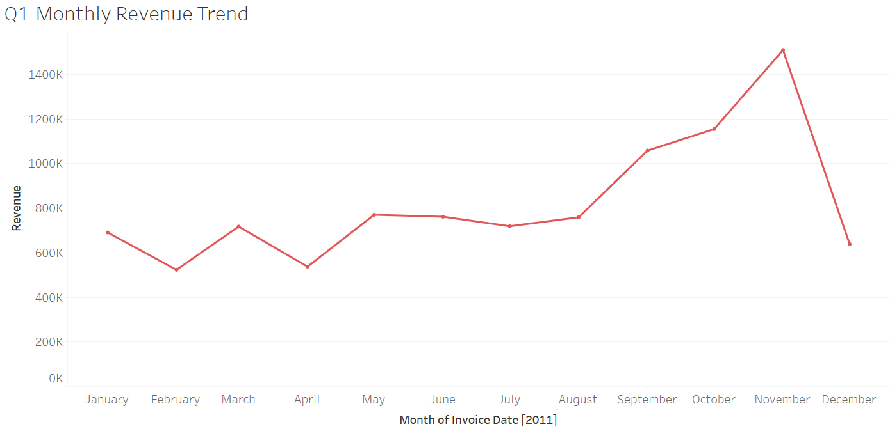

# Tata Data Visualisation: Empowering Business with Effective Insights

This project was completed as part of a virtual job simulation with Tata Consultancy Services via Forage in June 2025.

## Project Overview

The goal of this simulation was to help a fictional online retail client identify key revenue insights and expansion opportunities by preparing visuals and analysis for the CEO and CMO.

## Key Tasks Completed

1. **Framed Business Questions**  
   - Drafted relevant questions for the CEO and CMO focusing on revenue, customer behavior, and regional performance.

2. **Data Cleaning**  
   - Removed invalid records (e.g., negative quantity or unit price).
   - Filtered for relevant dates (2011 only) and removed returns.

3. **Dashboard Development** (using Tableau)
   - Created four dashboards for:
     - Monthly revenue trend (Q1)
     - Top 10 countries by revenue (excluding UK) (Q2)
     - Top 10 customers by revenue (Q3)
     - Global demand analysis by country (Q4)

4. **Insights & Recommendations**
   - Identified strong seasonality in last quarter of 2011.
   - Suggested geographic focus for expansion (Netherlands, Germany, France, etc.)
   - Noted customer diversity minimizes dependency on few top customers.

## Tools Used

- Tableau Public
- Microsoft Excel
- Python (for optional data cleaning)
- Forage Platform (simulation host)

## Repository Contents

- [`data/`](./data): cleaned dataset used for analysis
- [`visuals/`](./visuals): key charts/screenshots of dashboards
- [`dashboard/`](./Dashboard): Tableau packaged workbook (.twbx)
- [`scripts/`](./Python_Script): data cleaning script (optional but good to include)

## 📊 Visual Insights
- Seasonal sales trends in 2011
- Revenue by country (excluding UK)
- Top customers by revenue
- High-demand regions for expansion

## 🔧 Tools Used
- Tableau
- Python (Pandas)
- GitHub

## 🎯 Skills Practiced
- Business-focused analysis
- Visual storytelling
- Data cleaning
- Executive presentation

## 📽️ Walkthrough Video

Watch my full presentation to the CEO and CMO here: [bit.ly/tata_intern_demo](https://youtu.be/oLZ5L6PT_o4)

## 📈 Sample Visual

## 🏷️ Tags

`#Tableau` `#DataAnalysis` `#Consulting` `#Tata` `#BusinessIntelligence` `#Forage`

## 📜 License

This project is for educational and showcase purposes. Not affiliated with or endorsed by Tata Consultancy Services.
